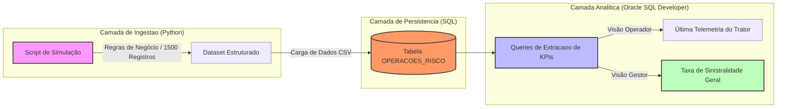
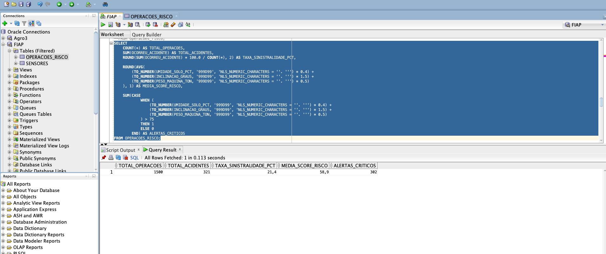
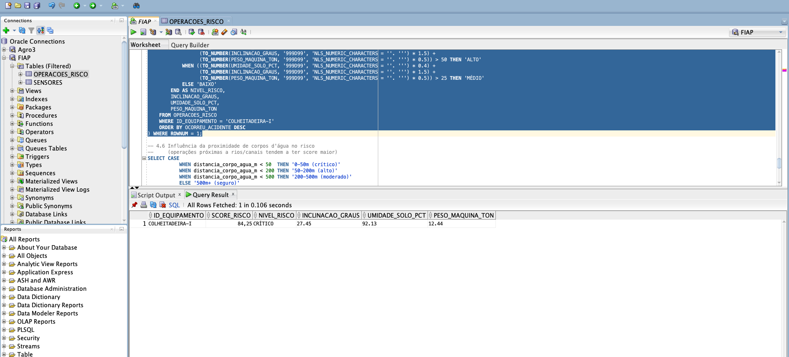

# FIAP - Faculdade de Informática e Administração Paulista

<p align="center">
<a href= "https://www.fiap.com.br/"></a>
</p>

<br>

# Challenge-Sompo-Seguros — AgroRisk Tracker (Sprint 2)

## 👨‍🎓 Integrantes: 
- <a href="https://www.linkedin.com/">Arthur Prudêncio Soares — RM569295</a>
- <a href="https://www.linkedin.com/">Caroline Coelho Mendes — RM570370</a>
- <a href="https://www.linkedin.com/">Leandro Paiva — RM572159</a> 
- <a href="https://www.linkedin.com/">Lucas Viana de Lima — RM571835</a> 
- <a href="https://www.linkedin.com/">Matheus Tavares Lima — RM572808</a>

## 👩‍🏫 Professores:
### Tutor(a) 
- <a href="https://www.linkedin.com/">Lucas Gomes</a>
### Coordenador(a)
- <a href="https://www.linkedin.com/">Prof. Dr. Rodrigo Mangoneli</a>

---

## 1. Entendimento do Problema
No agronegócio, maquinários pesados (tratores, colheitadeiras e pulverizadores) operam em terrenos hostis. Chuvas recentes e solos instáveis causam atolamentos e tombamentos, gerando altos custos de manutenção, tempo de máquina parada e sinistros caros para seguradoras como a Sompo. Atualmente, a decisão de operar ou não é baseada na intuição do operador (reativa).

## 2. Definição da Solução
Nossa solução é o **AgroRisk Tracker**, um sistema preditivo que integra engenharia de dados e análise computacional para mitigar e prever a probabilidade de sinistros no campo. Cruzando dados de chuva acumulada, umidade do solo capturada por sensores, inclinação lateral do terreno e o peso operacional de cada equipamento, o sistema calcula scores de risco e gera alertas preventivos de segurança para a gestão de frotas agrícolas da Sompo Seguros e de seus segurados.

## 3. Personas e User Stories
* **Operador da Máquina:** "Como operador, quero visualizar a telemetria instantânea do meu equipamento e o nível de severidade operacional (Baixo, Médio, Alto, Crítico) para desviar rotas perigosas com antecedência e mitigar acidentes."
* **Gestor da Fazenda:** "Como gestor, quero monitorar indicadores macro agregados como o total de operações, volumetria de acidentes e taxa de sinistralidade percentual da frota em tempo real para tomar decisões estratégicas."
* **Seguradora (Sompo):** "Como seguradora, quero acessar um histórico de dados limpo e estruturado em um banco de dados para auditar incidentes operacionais de forma justa e otimizar prêmios de apólices."

## 4. Estruturação dos Dados (Dataset Simulado)
Desenvolvemos um script robusto em Python responsável pela ingestão e simulação das variáveis de telemetria da frota, gerando uma massa de **1500 registros estruturados** no arquivo `dataset_agrorisk_simulado.csv`. 

O fator de risco oculto e os alertas preventivos são baseados na seguinte equação lógica:

$$\text{Fator de Risco} = (\text{Umidade Solo} \times 0.4) + (\text{Inclinação Graus} \times 1.5) + (\text{Peso Máquina} \times 0.5) + \text{Ruído Normal}$$

Se o fator calculado ultrapassar o limiar de **75**, um sinistro é registrado (`ocorreu_acidente = 1`).

### Dicionário de Dados do Dataset

| Nome da Coluna | Tipo de Dado | Descrição | Exemplo |
|:---|:---|:---|:---|
| `id_equipamento` | TEXT | Identificação do maquinário agrícola | `TRATOR-I` |
| `chuva_acumulada_mm` | REAL | Chuva acumulada nas últimas 48h (0 a 120 mm) | `84.35` |
| `umidade_solo_pct` | REAL | Umidade do solo influenciada pela chuva (0 a 100%) | `72.10` |
| `inclinacao_graus` | REAL | Angulação lateral do terreno operacional (0° a 35°) | `18.50` |
| `peso_maquina_ton` | REAL | Carga total estimada do equipamento (10 a 25 Ton) | `16.40` |
| `ocorreu_acidente` | INTEGER | Variável alvo binária (0 = Não, 1 = Sim) | `1` |

---

## 5. Arquitetura da Solução & Pipeline de Dados
O fluxo de processamento de dados da Sprint 2 conecta a engenharia de scripts ao ambiente relacional de banco de dados:



## 6. Resultados no Oracle SQL Developer
As consultas analíticas avançadas foram tratadas utilizando funções numéricas nativas e conversões explícitas de ponto decimal (TO_NUMBER), dividindo-se nas seguintes exibições:

**Visão do Gestor (KPIs Gerais)**
A consulta consolida indicadores macro agregando volumetria total e alertas críticos ativos.

</a>

Figura 1: Resultado da Query 4.1 exibindo as métricas de controle de risco macro.


**Visão do Operador (Telemetria Recente)**
A consulta isola os dados operacionais mais recentes da máquina utilizando subconsultas e ordenações por criticidade.

</a>

Figura 2: Resultado da Query 4.5 detalhando sensores e faixas de risco dinâmicas.

## 7. Estrutura de Pastas do Repositório

```text
├── data/
│   └── dataset_agrorisk_simulado.csv  # Massa de dados contendo as 1500 amostras
├── images/                             # Capturas de tela das queries executadas
├── sql/
│   └── queries.sql                    # Script contendo as consultas estruturadas para Oracle
├── src/
│   └── AgroTrackerSP2.py              # Script Python de geração da massa de dados
└── README.md                          # Documentacao oficial do projeto
```

## 8. Como Executar o Projeto
Pré-requisitos
Python 3.10 ou superior instalado.

Ambiente de banco de dados Oracle configurado via SQL Developer.

> Passo a Passo

Clonar o Repositório:

git clone [https://github.com/FarmTech-FIAP/Challenge-Sompo-Seguros.git](https://github.com/FarmTech-FIAP/Challenge-Sompo-Seguros.git)

Executar a Ingestão de Dados (Python):

python src/data_simulation.py

Importação do Banco:
Importe o arquivo gerado **dataset_agrorisk_simulado.csv** para o seu banco Oracle com o nome de tabela **OPERACOES_RISCO**.

Execução das Consultas SQL:
Abrir o arquivo sql/queries.sql dentro do Oracle SQL Developer e execute as análises para validação das métricas.

## 9. Apresentação em Vídeo
O vídeo com a explicação do escopo da arquitetura e a demonstração técnica das ferramentas rodando em ambiente local está disponível através do link:

👉 ASSISTIR VÍDEO DO PROJETO https://youtu.be/NrPCbI-dWCw

## Histórico de Entregas
Resumo da Sprint 1
Foco: Entendimento do problema de sinistros da Sompo Seguros e modelagem conceitual do ecossistema.

Resultados: Definição preliminar de personas, mapeamento de histórias de usuário e estruturação teórica do dataset de sensores.
