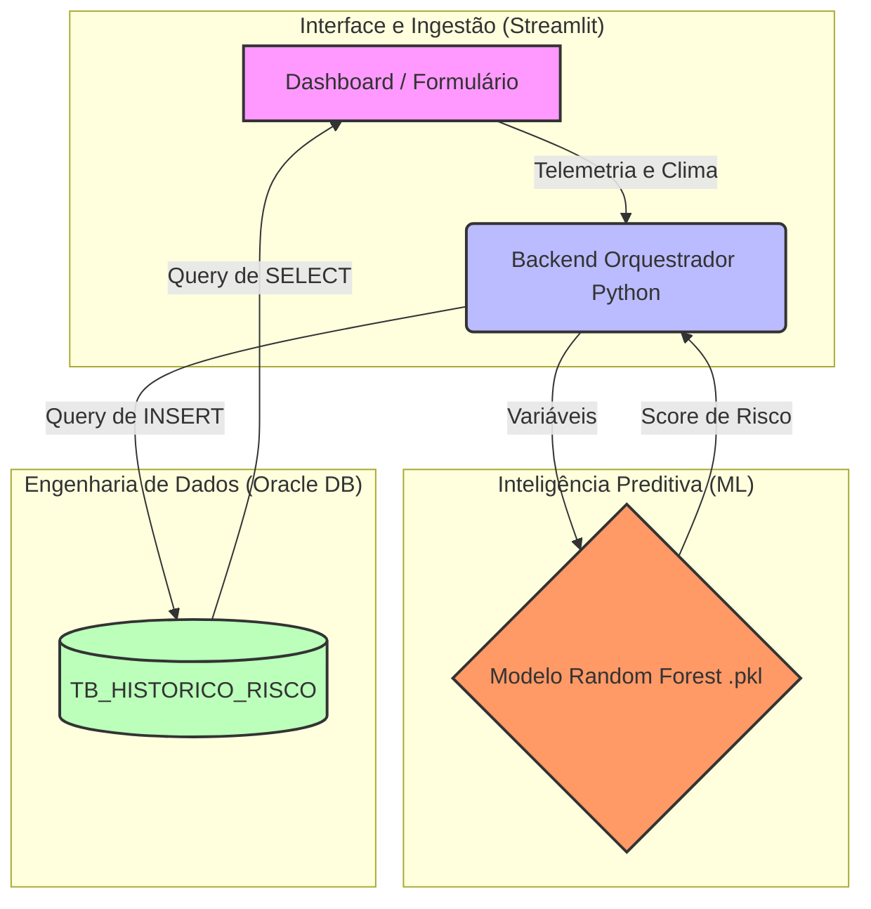

# FIAP - Faculdade de Informática e Administração Paulista

<p align="center">
<a href= "https://www.fiap.com.br/"></a>
</p>


<br>

# Challenge Sompo Seguros — AgroRisk Tracker (Sprint 3)

## 👨‍🎓 Integrantes: 
- <a href="https://www.linkedin.com/">Caroline Coelho Mendes — RM570370</a>
- <a href="https://www.linkedin.com/">Leandro Paiva — RM572159</a> 
- <a href="https://www.linkedin.com/">Lucas Viana de Lima — RM571835</a> 

## 👩‍🏫 Professores:
### Tutor(a) 
- <a href="https://www.linkedin.com/">Lucas Gomes</a> / <a href="https://www.linkedin.com/">Nicolly de Souza / Sabrina Otoni</a>
### Coordenador(a)
- <a href="https://www.linkedin.com/">Prof. Dr. Rodrigo Mangoneli</a>

---

## 1. Entendimento do Problema
No agronegócio, maquinários pesados operam sob condições climáticas e topográficas severas. Chuvas recentes e solos instáveis aumentam o risco de atolamentos e tombamentos, gerando ociosidade, custos operacionais massivos e sinistros caros para seguradoras como a Sompo. Atualmente, a operação carece de previsibilidade, operando de maneira reativa.

## 2. Definição da Solução (O MVP)
Nossa solução é o **AgroRisk Tracker**, agora consolidado em um **Produto Mínimo Viável (MVP)**. Trata-se de uma plataforma integrada que recebe dados de telemetria em tempo real (chuva, umidade, inclinação e peso), processa essas variáveis através de um modelo preditivo de Inteligência Artificial (Random Forest) e devolve um *Score de Risco* instantâneo. Além disso, garante governança corporativa ao persistir todas as análises automaticamente em um banco de dados relacional (Oracle).

## 3. Personas e Valor Entregue
* **Operador da Máquina:** Recebe feedbacks visuais imediatos e classificados (Seguro, Atenção, Crítico) no painel do sistema para desviar de rotas instáveis antes que o sinistro ocorra.
* **Gestor da Fazenda:** Obtém visão operacional sistêmica através da simulação de frotas e monitoramento centralizado no dashboard.
* **Seguradora (Sompo):** Acesso a um histórico imutável e auditável através do banco de dados conectado, otimizando análises de apólices e mitigação de perdas.

## 4. Segurança e Governança
Nesta Sprint, o sistema foi estruturado com foco em rastreabilidade e segurança da informação corporativa:
* **Controle de Acesso:** Interface bloqueada por camada de autenticação (Login/Senha) gerenciada via session state no Python.
* **Logs de Auditoria:** Implementação da biblioteca nativa `logging`. Todas as autenticações, predições da IA e eventuais falhas de comunicação com o banco de dados são gravadas em texto estruturado no arquivo local `auditoria_sistema.log`.
* **Tratamento de Exceções:** Arquitetura *fail-safe* que impede a quebra do sistema (crash) caso o banco de dados principal apresente timeout.

---

## 5. Arquitetura da Solução & Pipeline Integrado
O fluxo do sistema agora é totalmente orquestrado em Python, ligando o front-end ao back-end inteligente e ao data warehouse.



## 6. Dicionário de Dados (Script SQL)
- O histórico é persistido utilizando o seguinte padrão Oracle SQL:
```text
SQL
CREATE TABLE tb_historico_risco (
    id_leitura          NUMBER GENERATED ALWAYS AS IDENTITY PRIMARY KEY,
    id_equipamento      VARCHAR2(50) NOT NULL,
    data_hora           TIMESTAMP DEFAULT CURRENT_TIMESTAMP,
    chuva_acumulada_mm  NUMBER(5,2) NOT NULL,
    umidade_solo_pct    NUMBER(5,2) NOT NULL,
    inclinacao_graus    NUMBER(5,2) NOT NULL,
    peso_maquina_ton    NUMBER(5,2) NOT NULL,
    score_risco         NUMBER(3) NOT NULL,
    classificacao_alerta VARCHAR2(20) NOT NULL
);           
```

## 7. Estrutura de Pastas do Repositório
```text
├── 📁 assets/
│   └── logo-fiap.png                   # Logo FIAP
├── 📁 data/
│   └── dataset_agrorisk_simulado.csv   # Massa de dados gerada na Sprint 2 para treinamento
│   └── auditoria_sistema.log           # Arquivo gerado automaticamente contendo os rastros de uso
├── 📁 images/
|   └── logo_agrorisk.jpeg              # Identidade visual da plataforma
├── 📁 scr/
│   └── AgroTrackerSP3.py               # Backend integrador (MVP Completo via Streamlit)
│   └── ia_training.py                  # Script de treinamento do modelo Random Forest
│   └── modelo_agrorisk.pkl             # Modelo de IA treinado e persistido (Cérebro do sistema)
├── 📁 sprints_passadas/
├── 📁 sql/
│   └── script_oracle.sql               # Arquivo de texto com o CREATE TABLE
├── README.md                           # Documentação oficial do projeto
└── requirements.txt                    # Lista de dependências e bibliotecas

```

## 8. Como Executar o Projeto Localmente
Pré-requisitos: Python 3.9+

- Clone o repositório para a sua máquina local:
```text
Bash
git clone [https://github.com/FarmTech-FIAP/Challenge-Sompo-Seguros.git](https://github.com/FarmTech-FIAP/Challenge-Sompo-Seguros.git)
cd Challenge-Sompo-Seguros             
```
- Instale as bibliotecas e dependências do projeto:
```text
Bash
pip install -r requirements.txt
```
- Execute a aplicação (O servidor Streamlit será iniciado no seu navegador):
```text
Bash
streamlit run AgroTrackerSP3.py
```
- Credenciais de Acesso ao Sistema:
```text
Usuário: admin
Senha: sompo2026
```

## 9. Apresentação em Vídeo
O vídeo demonstrando o MVP em funcionamento de ponta a ponta, detalhando a tela de login, a execução do modelo preditivo e a consulta do banco de dados na interface, está disponível através do link abaixo:

👉 ASSISTIR VÍDEO DO PROJETO:

## 10. AHistórico de Entregas
> Resumo da Sprint 2
> 
Foco: Engenharia de Dados, Simulação Estatística e Modelagem de Banco Relacional.

Resultados:

- Criação de um script Python utilizando regressões lógicas paramétricas para geração de um dataset sintético limpo com 1500 registros (dataset_agrorisk_simulado.csv).

- Implementação da infraestrutura DDL no Oracle SQL Developer, criando tabelas com restrições (CONSTRAINTS e CHECKS) para controle de integridade dos dados.

- Execução de queries analíticas para extração de métricas de negócio e taxas de sinistralidade.

> Resumo da Sprint 1
> 
Foco: Entendimento do problema de sinistros da Sompo Seguros e modelagem conceitual do ecossistema.

Resultados: Definição preliminar de personas, mapeamento de histórias de usuário, arquitetura de hardware IoT teórica (ESP32) e estruturação do negócio de forma reativa para preventiva.
